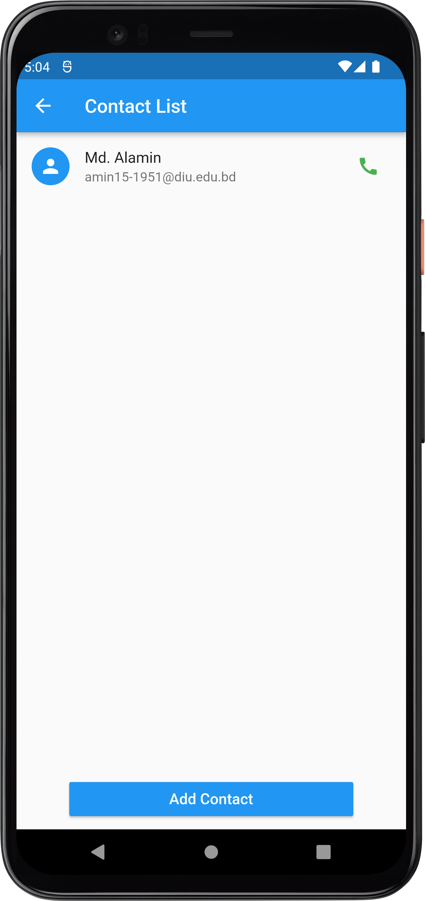

# GetX with Flutter

This is a Flutter Application where I have practice GetX State Management. Here I have use GetX utilities,snackBar,Obx,Todo App, Contact App, Api Calling & Localization etc.

## Live Site:

Link: https://cpad-gazipur.github.io/GetX-with-Flutter/

## Download APK:

Link: https://terabox.com/s/1ZJZDKUdsxVNFgeK_lIXkBw

## Phone Screenshots:

| Home Screen      |  API Screen |  BottomSheet Screen |
| :---:       |    :----:   | :----:   |
|        |       |    |

| ContactList Screen      |  Dialog Screen |  Home Screen (Bangla) |
| :---:       |    :----:   | :----:   |
|        |       |    |

| Obx Example Screen      |  SnackBar Screen |  Todo App Screen |
| :---:       |    :----:   | :----:   |
|        |       |    |

| Utility Screen      |  
| :---:       |  
|        |

## Web Screenshots:

| WebView Home Screen     | 
| :---:       |  
|       | 

### Disclaimer
This project is made only for educational purpose. Anyone can use it but the risk has to be taken by the user.
for any query please contact me.

### Repository Owner Info

### Md. Al-Amin
##### Junior Software Engineer (Android & iOS) at Rokomari.com

__Email :__ [ alamin.karno@outlook.com ](mailto:alamin.karno@outlook.com) \
__Github :__ [Md. Al-Amin](https://github.com/alamin-karno) \
__Facebook :__ [মোঃ আল-আমিন খন্দকার কর্ণ](https://facebook.com/alamin.kanro786) \
__Linkedin :__ [Md. Alamin Karno](https://www.linkedin.com/in/alaminkarno/)

